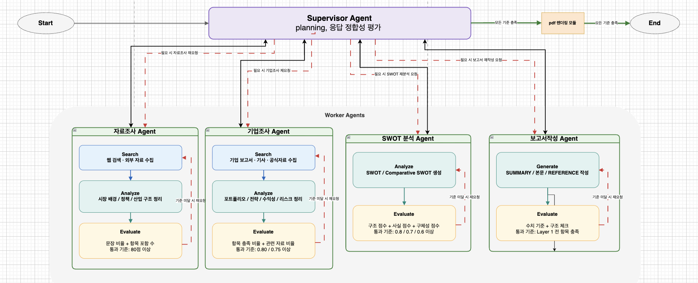

# 배터리 시장 전략 분석 시스템

멀티 에이전트 기반 배터리 시장 자동 분석 및 전략 보고서 생성 시스템

## Overview
- Objective : LG에너지솔루션·CATL 대상 배터리 시장 전략 보고서 자동 생성
- Method : Supervisor 패턴 멀티 에이전트 + RAG 기반 문서 검색
- Tools : OpenAI GPT-4, ChromaDB, Tavily Search, BAAI/bge-m3

## Features
- PDF·웹 자료 기반 증거 수집 및 섹션별 RAG 검색
- Supervisor가 4개 에이전트 순차 조율 (시장조사 → 기업조사 → SWOT → 보고서)
- 증거 부족 섹션 자동 재검색 (최대 2라운드)
- pdf보고서 자동 생성

## Tech Stack

| Category  | Details                              |
|-----------|--------------------------------------|
| LLM       | GPT-4 via OpenAI API                |
| Retrieval | ChromaDB + Tavily Search             |
| Embedding | BAAI/bge-m3                          |
| Framework | LangChain, Pydantic, Python          |

## Agents

- **Supervisor**: 전체 워크플로우 조율 및 상태 관리
- **Market Research Agent**: 배터리 시장 규모·트렌드·경쟁구도 분석
- **Company Research Agent**: LG에너지솔루션·CATL 전략 분석 (포트폴리오, 경쟁력, 리스크 등 6개 섹션)
- **SWOT Analysis Agent**: 시장·기업 정보 기반 비교 SWOT 분석
- **Report Writer Agent**: 전체 분석 결과 통합 보고서 작성

## Architecture



```
Supervisor
├── Market Research Agent  (RAG + Web Search)
├── Company Research Agent (RAG + Web Search)
├── SWOT Analysis Agent    (LLM 분석)
└── Report Writer Agent    (보고서 생성)
```

## Directory Structure

```
├── agents/        # 에이전트 모듈 (supervisor, market_research, company_research, swot_analysis, report_writer)
├── retrieval/     # RAG 검색 엔진
├── config/        # 설정 및 공유 스키마
├── shared/        # LLM 클라이언트, 로거, 유틸
├── data/          # 원본 문서 및 벡터 DB
├── outputs/       # 보고서 및 로그
├── scripts/       # 실행 스크립트
└── tests/         # 테스트
```

## Quick Start

```bash
pip install -r requirements.txt
cp .env.example .env          # OPENAI_API_KEY 설정

python scripts/ingest_documents.py   # 문서 임베딩
python scripts/run_workflow.py       # 전체 파이프라인 실행
```

## Contributors
- 기동주 : Report writer Agent
- 김정우 : Swot analysis Agent
- 박유빈 : Vector DB, Retrieval, Company Research Agent
- 차민희 : Market Research Agent
  
